# ~/.shell/

-------------------------------------------------------------------------------

This folder is used to manage my prompt, alias, completion, etc...

-------------------------------------------------------------------------------

# Table of content

<!-- vim-markdown-toc GitLab -->

* [Description](#description)
* [Prompt description](#prompt-description)
* [Files and folders](#files-and-folders)
    * [~/.zshrc and ~/.bashrc](#zshrc-and-bashrc)
    * [completion/](#completion)
    * [doc/](#doc)
    * [hosts/](#hosts)
    * [lib/](#lib)
    * [plugin/](#plugin)
    * [LS_COLORS](#ls_colors)
* [How to use it ?](#how-to-use-it-)
    * [Using `vcsh`](#using-vcsh)
    * [Not using `vcsh`](#not-using-vcsh)
    * [Configuration](#configuration)
* [FAQ](#faq)

<!-- vim-markdown-toc -->

# Description

This folder (with the files ~/.zshrc and ~/.bashrc) are my scripts allowing me
show my prompt and set my own plugins, alias, completion, etc. Its part of my
dotfiles repo where I store most of my dotfiles configuration.

The aim of this folder is to unify the management of bash and zsh prompt and
configuration such alias, completion, etc.

# Prompt description

Here is some screenshots of my prompts, there are two versions of it:
- The v1 is "classic" as show below for bash and zsh.

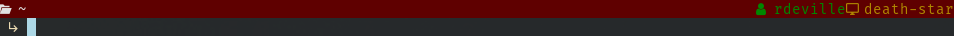

- The v2 is more "powerline like" as show below for bash and zsh.

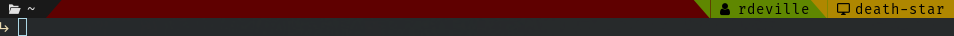

In both case, (almost) all parts (colors, character, to show it or not) are
configurable. You can either choose to show only some informations or change its
colors depending on what you what.

**Base prompt**

As I live mainly in terminal, I like to be able to have some information options
when I open it. To do so, I use
[neofetch](https://github.com/dylanaraps/neofetch) with its configuration file
`~/.config/neofetch/config.conf` (see [My neofetch
configuration](../../.doc/config/neofetch/README.md)).

The above show my prompt when no "environment" is loaded. The colored horizontal
line is here to help me know quickly on which type of computer I am (for
instance, red for professional workstation, magenta for professional servers,
green for personnal workstation, yellow for personal servers, etc.). All colors
of the prompt (the current directory, the username, etc.) can be easily change
for each computer based on its hostname (see section [hosts/](#hosts)).

Moreover, when logged as `root` all the prompt shift to bold, thus I know
visually that I am `root` and things I do can be dangerous. See below for an
example.

_v1 Root_
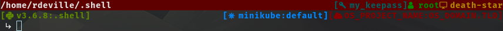

_v2 Root_
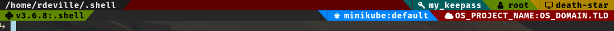

**Full options shown**

_Prompt v1_
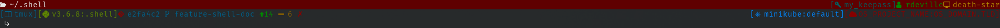
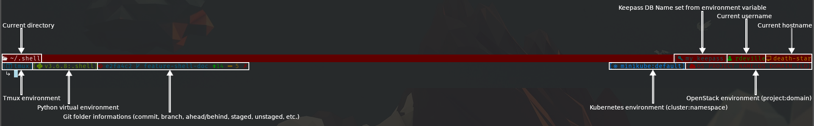

_Prompt v2_
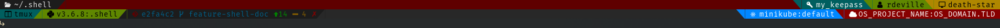
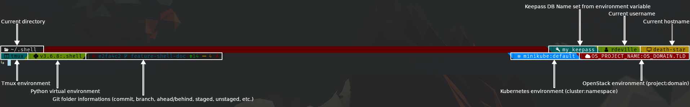

Here you can see my prompts when all environment are loaded. Supported
environment are :

  - tmux
  - python
  - git
  - openstack
  - kubernetes
  - keepass

Every environment information, colors and character can be configure
individually to be shown or not (see section [hosts/](#hosts))

**Environment contraction**

When there is not enough space to show all environment informations completely,
they will be contracted to show only the character of the environment. The more
your terminal will shorten, the less options will be shown. Options are always
contracted in the same order, i.e. tmux first, then kubernetes, then openstack,
etc. Finally, if there is really not enough space, some information will be
completely hidden. Exemple of contraction are shown below for both prompt.

_Prompt v1_
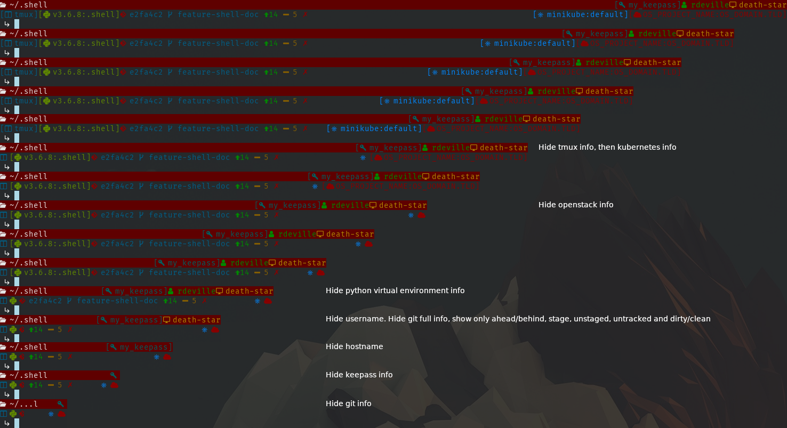

_Prompt v2_
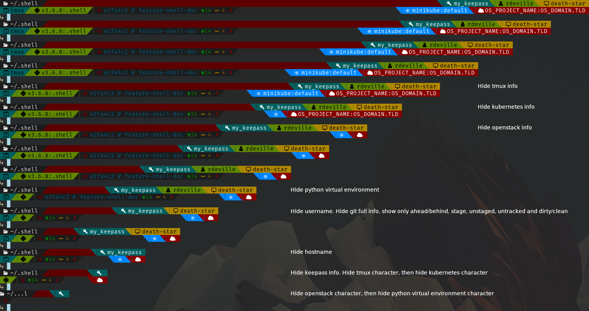

**Default prompt when no colors sets**

By default, if no file exists in folder `hosts/` with the name `$(hostname).sh`
or with the name `common.sh`, no colors will be set, as shown below for both
versions.

_Prompt v1_
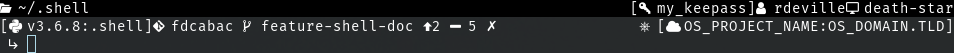

_Prompt v2_
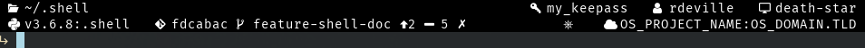

**If you want to use my prompt and to configure colors, etc, you can read the
documentation in [~/.doc/shell/hosts/README.md](hosts/README.md)**

# Files and folders

Here I will briefly describe the content of the file of this repo in case you
want to upgrade it for yourself or to help you understand what is done.

## ~/.zshrc and ~/.bashrc

These file are basically a `main` method that source files over the following
folders:

  - `${SHELL_DIR}`/lib
  - `${SHELL_DIR}`/plugin
  - `${SHELL_DIR}`/completion

If neofetch is installed, then launch it once at the opening of the terminal.
Finnaly, it setup some exported variables used by my shell dotfiles, like
`SHELL_DIR`, `SHELL`, `EDITOR`, `PATH`, `PROMPT_VERSION` and `TERM` and finally
load the `LS_COLORS`. More about these last variables are describe in [`hosts/`
documentation](../../.doc/shell/hosts/README.md)

## completion/

This folder is not done by myself, but is composed of downloaded scripts from
either software documentation (for docker and docker-compose) or from nice
person that did them.

Normally, origin of these scripts are written inside corresponding files.

## doc/

This folder store the documentation of my shell plugin, alias, etc. It take the
same structure of my `~/.shell` folder.

## hosts/

This folder is here to store your personnal configuration. By default, there is
two files that might interest you:

  - `template.sh`: A template of all configurable variables to setup your prompt
   colors and environment to show. This file is commented and all values set in
   this file are default values except for the colors.
  - `common.sh`: A template of variables I use to have some common configuration
   accross my computer (like same colors for environment for each computer).
   This is the file use for the screenshots above. Then for each workstation I
   have, they have their own configuration file in the form `$(hostname).sh`.
   For instance, file `death-star.sh` is the configuration for one of my
   computer which hostname is `death-star`.

## lib/

This folder store all methods used to prompt my terminal, such as key-binding,
git info, prompt info depending on version choosen, etc.

## plugin/

This folder store all "plugin" I use, these are mainly bash script that describe
method and alias for each software. Usually, these files start with a If/Else
condition to ensure the command is installed to load the define method and
aliases.

## LS_COLORS

This file come from <a href="mailto:Magnus Woldrich <m@japh.se>">Magnus
Woldrich</a>, original link to the file is written as comment inside it. It
describe colors for most type of files. I just added some personnal
configuration.

# How to use it ?

This repo is versioned using [git](https://git-scm.com/) and
[vcsh](https://github.com/RichiH/vcsh). To be able to use it,
you have two possibilities:

- [Using `vcsh`](#using-vcsh)
- [Not using `vcsh`](#not-using-vcsh)

## Using `vcsh`

If you are using or want to use vcsh to manage your dotfiles. First, you must
install `vcsh` and `git`:

**On debian based (Debian/Ubuntu)**
```bash
$ sudo apt install vcsh git
```

**On RedHat based (Centos,Fedora,RHEL)**
```bash
$ sudo dnf install vcsh git (TODO: Verify)
```

**On Archlinux**
```bash
$ sudo pacman -S git
# Then depending on your AUR helpers, you will have to install vcsh from AUR:
# https://aur.archlinux.org/packages/vcsh/
```

Once this is done, you will need to backup some of your existing files such as:
- `~/.bashc`
- `~/.zshrc`
- `~/.shell` (only if you already have file/folder with this name)

Indeed, if you do not do this, you will not be able to clone this repo.

```bash
$ mv ~/.bashrc ~/.bashrc.bak
$ mv ~/.zshrc ~/.zshrc.bak
$ mv ~/.shell ~/.shell.bak
```
Once this is done, you can clone the repo

```bash
$ vcsh clone git@framagit.org:rdeville/dotfiles.shell.git shell
# or
$ vcsh clone https://framagit.org/rdeville/dotfiles.shell.git shell
```

Finally, you can configure the prompt to your need. To do so, continue to
section [Configuration](#configuration)

## Not using `vcsh`

If you are not using or do not want to use `vcsh`, you will need git.

**On debian based (Debian/Ubuntu)**
```bash
$ sudo apt install git
```

**On RedHat based (Centos,Fedora,RHEL)**
```bash
$ sudo dnf install git (TODO: Verify)
```

**On Archlinux**
```bash
$ sudo  TODO
```

Once this is done, you will need to backup some of your existing files such as:
- `~/.bashc`
- `~/.zshrc`
- `~/.shell` (only if you already have file/folder with this name)

Indeed, if you do not do this, you will not be able to create symlink to this
repo.
```bash
$ mv ~/.bashrc ~/.bashrc.bak
$ mv ~/.zshrc ~/.zshrc.bak
$ mv ~/.shell ~/.shell.bak
```

Once this is done, you can clone the repo whereever you want, let us say in a
the folder `~/.dotfiles/shell`

```bash
$ git clone git@framagit.org:rdeville/dotfiles.shell.git ~/.dotfiles/shell
# or
$ git clone https://framagit.org/rdeville/dotfiles.shell.git ~/.dotfiles/shell
```

Then, you will need to create some symlinks to the following files/folders:

- `.bashrc`
- `.zshrc`
- `.shell`
- `.doc/shell`

To do so, type the following command:

```bash
ln -s ~/.dotfiles/shell/.bashrc ~/.bashrc
ln -s ~/.dotfiles/shell/.zshrc ~/.zshrc
ln -s ~/.dotfiles/shell/.shell ~/.shell
mkdir ~/.doc
ln -s ~/.dotfiles/shell/.doc/shell ~/.doc/shell
```

Finally, you can configure the prompt to your need. To do so, continue to
section [Configuration](#configuration)

## Configuration

All configuration are done within folder `~/.shell/hosts`, first, read following
section [hosts/](#hosts) to know what there is in this folder.

Once done, you can read the configuration documentation which is in
[~/.doc/shell/hosts/README.md](../.doc/shell/hoss/README.md). In this file is
describe what you can configure and how.

# FAQ

**Why not using some prompt framework like
[bash-it](https://github.com/Bash-it/bash-it),
[oh-my-zsh](https://github.com/robbyrussell/oh-my-zsh) or
[prezto](https://github.com/sorin-ionescu/prezto) ?**

I used to use bash-it and oh-my-zsh, but I was overhelmed by all their options,
plugins, etc., that I not fully used. Moreover, I had to manage two
configuration, one for bash and one for zsh. So I ended on making my own with
only things I need and I try to unified bash and zsh.

**Why managing both bash and zsh**

I'm a sysadmin, and I try to not install thing that could upset my coworker
which mainly used bash. Moreover, bash is installed by default on most GNU/Linux
distribution, allowing me to get my own prompt even on the most basic GNU/Linux
installation.
