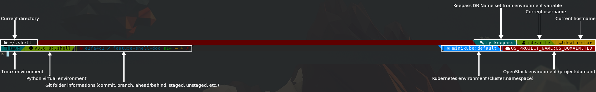

# ~/.shell/hosts

-------------------------------------------------------------------------------

This folder aims to store configuration variables for your hosts workstations.

-------------------------------------------------------------------------------

# How to configure your workstations

I tried to make my prompt as configurable as possible. It end up by setting
almost all configuration to variables. Variables are :
- boolean to show or not some section of the prompt
- colors of these section
- special character that start are at the starting of a section.

There is two main types of configuration variables:
- common to prompt v1 and v2
- variables specific to v1 and specific to v2

To setup a configuration for your workstations you have two possibilities:
- create/modify the file `common.sh` which will be loaded if the file exists and
 will allow you to apply some common variables configuration to any of your
 workstations.
- create a file which name is the hostname of your workstation (for instance,
 the file `death-star.sh` is a configuration for one of my workstation which
 hostname is `death-star`.

Finally, you can combine both, create/modify file `common.sh` to set some
default variables for all your workstations and another file with name
`$(hostname).sh` to setup specific configuration.

Alreay in this repo are files:
- `common.sh` which is my personnal common configuration for all my workstation
- `death-start.sh` which is the specific configuration of my workstation
 `death-start`. In this file, I only overlead variable that define the default
 background color of my prompt.

These two file are those I used for the following screenshot.

All variables in these files are optional. If not set, my scripts will load
default value written as comment in files `common.sh` and `death-star.sh`.

**Prompt v1**

**Prompt v2**

# Common variables to prompt v1 and v2

## Environment section information

These variables set wether to show or not some section and which character start
these section.

| Variables             | Default value | Description                                                           |
|-----------------------|---------------|-----------------------------------------------------------------------|
| `USER_CHAR`           | ` `          | Character to show before the current path                             |
| `HOSTNAME_CHAR`       | ` `          | Character to show before hostname                                     |
| `SHOW_KEEPASS_INFO`   | `true`        | Boolean, `true` to show keepass section                               |
| `KEEPASS_CHAR`        | ` `          | Character to show at the start of section keepass                     |
| `SHOW_TMUX_ENV`       | `true`        | Boolean, `true` to show tmux section                                  |
| `TMUX_CHAR`           | ` `          | Character to show at the start of section tmux                        |
| `SHOW_KUBE_ENV`       | `true`        | Boolean, `true` to show kubernetes section                            |
| `KUBE_CHAR`           | `⎈ `          | Character to show at the start of section kubernetes                  |
| `SHOW_OPENSTACK_ENV`  | `true`        | Boolean, `true` to show openstack section                             |
| `OPENSTACK_CHAR`      | ` `          | Character to show at the start of section openstack                   |
| `SHOW_VIRTUALENV_ENV` | `true`        | Boolean, `true` to show virtual environment section                   |
| `VIRTUALENV_CHAR`     | ` `          | Character to show at the start of section showing virtual environment |
| `SHOW_VCS_ENV`        | `true`        | Boolean, `true` to show vcs section                                   |
| `VCS_COLORED`         | `false`       | Boolean, `true` to show vcs section with colors                       |
| `VCS_CHAR`            | ``           | Character to show at the start of section vcs                         |

## Git section information

This variables are specific to vcs section when in git folder.

| Variables               | Default value | Description                                                                                         |
|-------------------------|---------------|-----------------------------------------------------------------------------------------------------|
| `GIT_IGNORE_UNTRACKED ` | `false`       | Boolean, `true` to show untracked files in the prompt                                               |
| `GIT_PROMPT_DIRTY`      | `✗`           | Character to show that local git repo is dirty                                                      |
| `GIT_PROMPT_CLEAN`      | `✓`           | Character to show that local git repo is clean                                                      |
| `GIT_BRANCH_PREFIX`     | ``           | Character shown before the branch name                                                              |
| `GIT_TAG_PREFIX`        | `笠[`         | Characters prefix around tag when repo is at a tagged commit                                        |
| `GIT_TAG_SUFFIX`        | `]`           | Characters suffix around tag when repo is at a tagged commit                                        |
| `GIT_DETACHED_PREFIX`   | ` `          | Characters prefix around commit when repo is detached from HEAD                                     |
| `GIT_DETACHED_SUFFIX`   | `]`           | Characters suffix around commit when repo is detached from HEAD                                     |
| `GIT_CHAR`              | ``           | Character to show at the begining of the section when in git repo                                   |
| `GIT_AHEAD_CHAR`        | `ﰵ`           | Character to show when current repo is ahead of the remote corresponding branch on remote `origin`  |
| `GIT_BEHIND_CHAR`       | `ﰬ`           | Character to show when current repo is behind of the remote corresponding branch on remote `origin` |
| `GIT_UNTRACKED_CHAR`    | ``           | Charater to show that files are untracked, it will be followed by the number of untracked files     |
| `GIT_UNSTAGED_CHAR`     | ``           | Charater to show that files are unstaged, it will be followed by the number of untracked files      |
| `GIT_STAGED_CHAR`       | ``           | Charater to show that files are staged, it will be followed by the number of untracked files        |
| `GIT_STASH_CHAR_PREFIX` | `{`           | Charaters prefix when works are stashed                                                             |
| `GIT_STASH_CHAR_SUFFIX` | `}`           | Charaters suffix when works are stashed                                                             |

## Remark about char

If you do not see default values or your char are not printed correctly, this
means:
- Your terminal emulator does not support glyphs or unicode encoding
- Your terminal emulator does support glyphs but the font you choose does not
- Your terminal emulator does support glyphs and the font you choose does too,
 but you will have to modify a scripts in this repo.

If it is the first case, unfortunately, you will not be able to print any
unicode character.

If it is the second case, please see the documentation of your terminal emulator
in order to know how to change the font it uses.

If it is the last case, you will have to add your terminal name in the table
`UNICODE_SUPPORTED_TERM` in the file `~/.shell/lib/01.terminal.sh`

# Variables specific to the version of the prompt (v1 or v2)

Most following variables have the same name for v1 and v2 as they define mainly
foreground and background colors. But some variables are useless in v1.
Following section will describe their meaning for each version.

Some examples are given in folder `~/.shell/hosts/examples`

## Remark about coloring

Some terminal emulator support only 8/16 colors, others 256 colors and others
support true colors. Depending on which terminal emulator you use, you might
need to setup colors syntax according to the number of colors supported by your
terminal emulator.

For more information about the syntax for terminal that support up to 16 colors
or up to 256 colors:
- https://misc.flogisoft.com/bash/tip_colors_and_formatting

To know if your terminal support true colors (i.e. 24 bits colors), and the
syntax to use:
- https://gist.github.com/XVilka/8346728

Finally, when setting colors variables, you do not need to write the full
syntax, just enter the color code as value as the color code syntax will be set
by my scripts depending on your terminal as shown below:

| Color          | 16 colors | 256 colors | True colors    | Wrong values |
|----------------|-----------|------------|----------------|--------------|
| Red Foreground | 31        | 38;2;196   | 38;2;255;0;0;0 | \e[31m       |
| Red Background | 41        | 48;2;196   | 48;2;255;0;0;0 | \e[41m       |

Set of 256 hexadecimal colors supported by 256 colors terminal are shown at the
end of the file `common.sh` and `deth-star.sh`.

**Troubleshoot**: If you know your terminal emulator should support true colors
but does not print them, you will have to add your terminal name in the table
`TRUE_COLOR_TERM` in the file `~/.shell/lib/01.terminal.sh`

## Variables specific to prompt v1

All default variables are such that background is black and foreground is white.

| Variables             | Description                                                                                              |
|-----------------------|----------------------------------------------------------------------------------------------------------|
| `PROMPT_ENV_LEFT`     | Defaul `[`, the character on the left of the environment shown                                           |
| `PROMPT_ENV_RIGHT`    | Defaul `]`, the character on the right of the environment shown                                          |
| `DEFAULT_FG`          | Default foreground color                                                                                 |
| `DEFAULT_BG`          | Default background color, i.e. the color of the horizontal line                                          |
| `RETURN_CODE_FG`      | The foreground color of the return code                                                                  |
| `CORRECT_WRONG_FG`    | If using zsh, the foreground colors of the wrong command when printing correction                        |
| `CORRECT_RIGHT_FG`    | If using zsh, the foreground colors of the proposed command when printing correction                     |
| `PWD_FG`              | The foreground color of the current path                                                                 |
| `USER_FG`             | The foreground color of the current username                                                             |
| `HOST_FG`             | The foreground color of the current hostname                                                             |
| `KEEPASS_FG`          | The foreground color of the keepass DB name loaded                                                       |
| `TMUX_FG`             | The foreground color of the tmux section                                                                 |
| `VIRTUALENV_FG`       | The foreground color of the virtual environment section                                                  |
| `KUBE_FG`             | The foreground color of the kubernetes loaded cluster and namespace                                      |
| `OPENSTACK_FG`        | The foreground color of the openstack loaded project name and domain                                     |
| `VCS_FG`              | The foreground color of the vcs section                                                                  |
| `VCS_PROMPT_DIRTY_FG` | The foreground color when the current versioned repo is dirty                                            |
| `VCS_PROMPT_CLEAN_FG` | The foreground color when the current versioned repo is clean                                            |
| `VCS_BRANCH_FG`       | The foreground color when showing the branch name                                                        |
| `VCS_TAG_FG`          | The foreground color of the tag when the current versioned repo is at a tagged commit                    |
| `VCS_DETACHED_FG`     | The foreground color of the commit when the current versioned repo is detached from HEAD                 |
| `VCS_COMMIT_FG`       | The foreground color of the current commit in the versioned repo                                         |
| `VCS_AHEAD_FG`        | The foreground color when the current versioned repo is ahead of the correspond remote branch on origin  |
| `VCS_BEHIND_FG`       | The foreground color when the current versioned repo is behind of the correspond remote branch on origin |
| `VCS_UNTRACKED_FG`    | The foreground color of the untracked file informations in the current versioned repo                    |
| `VCS_STAGED_FG`       | The foreground color of the staged file informations in the current versioned repo                       |
| `VCS_UNSTAGED_FG`     | The foreground color of the unstaged file informations in the current versioned repo                     |
| `VCS_STASH_FG`        | The foreground color when changes are stahed                                                             |

## Variables specific to prompt v2

All default variables are such that background is black and foreground is white.

| Variables             | Description                                                                                              |
|-----------------------|----------------------------------------------------------------------------------------------------------|
| `PROMPT_ENV_LEFT`     | Defaul ` `, the character on the left of the environment shown                                           |
| `PROMPT_ENV_RIGHT`    | Defaul ` `, the character on the right of the environment shown                                          |
| `DEFAULT_FG`          | Default foreground color                                                                                 |
| `DEFAULT_BG`          | Default background color, i.e. the color of the horizontal line                                          |
| `RETURN_CODE_FG`      | The foreground color of the return code                                                                  |
| `CORRECT_WRONG_FG`    | If using zsh, the foreground colors of the wrong command when printing correction                        |
| `CORRECT_RIGHT_FG`    | If using zsh, the foreground colors of the proposed command when printing correction                     |
| `PWD_FG`              | The foreground color of the current path                                                                 |
| `PWD_BG`              | The background color of the current path                                                                 |
| `USER_FG`             | The foreground color of the current username                                                             |
| `USER_BG`             | The background color of the current username                                                             |
| `HOST_FG`             | The foreground color of the current hostname                                                             |
| `HOST_BG`             | The background color of the current hostname                                                             |
| `KEEPASS_FG`          | The foreground color of the keepass DB name loaded                                                       |
| `KEEPASS_BG`          | The background color of the keepass DB name loaded                                                       |
| `TMUX_FG`             | The foreground color of the tmux section                                                                 |
| `TMUX_BG`             | The background color of the tmux section                                                                 |
| `VIRTUALENV_FG`       | The foreground color of the virtual environment section                                                  |
| `VIRTUALENV_BG`       | The background color of the virtual environment section                                                  |
| `KUBE_FG`             | The foreground color of the kubernetes loaded cluster and namespace                                      |
| `KUBE_BG`             | The background color of the kubernetes loaded cluster and namespace                                      |
| `OPENSTACK_FG`        | The foreground color of the openstack loaded project name and domain                                     |
| `OPENSTACK_BG`        | The background color of the openstack loaded project name and domain                                     |
| `VCS_FG`              | The foreground color of the vcs section                                                                  |
| `VCS_BG`              | The background color of the vcs section                                                                  |
| `VCS_PROMPT_DIRTY_FG` | The foreground color when the current versioned repo is dirty                                            |
| `VCS_PROMPT_CLEAN_FG` | The foreground color when the current versioned repo is clean                                            |
| `VCS_BRANCH_FG`       | The foreground color when showing the branch name                                                        |
| `VCS_TAG_FG`          | The foreground color of the tag when the current versioned repo is at a tagged commit                    |
| `VCS_DETACHED_FG`     | The foreground color of the commit when the current versioned repo is detached from HEAD                 |
| `VCS_COMMIT_FG`       | The foreground color of the current commit in the versioned repo                                         |
| `VCS_AHEAD_FG`        | The foreground color when the current versioned repo is ahead of the correspond remote branch on origin  |
| `VCS_BEHIND_FG`       | The foreground color when the current versioned repo is behind of the correspond remote branch on origin |
| `VCS_UNTRACKED_FG`    | The foreground color of the untracked file informations in the current versioned repo                    |
| `VCS_STAGED_FG`       | The foreground color of the staged file informations in the current versioned repo                       |
| `VCS_UNSTAGED_FG`     | The foreground color of the unstaged file informations in the current versioned repo                     |
| `VCS_STASH_FG`        | The foreground color when changes are stahed                                                             |

# Additional notes

If you want a good starting point, I provided the file `common.sh` that I use
as base configuration for all my workstations. This file have lots of comment to
help understand what variables stands for. Moreover, in this file, I alread
handled most configuration, such as defining variable for 16 colors terminal
emulator, 256 colors terminal emulator and true colors terminal emulator. You
can copy it to your desire `$(hostname).sh` or simply modify its value to make
it your own.
